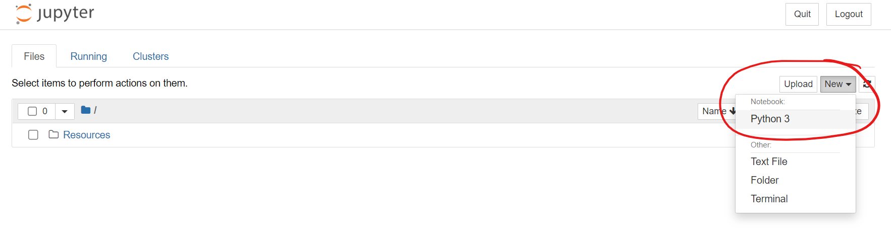

# Module 18 - Supervise-ML

## Module Supplement

### 18.2.3 - Linear Regression Example

- When creating the `linear_regression_salary` folder, I would recommend having this organized into where you have files for Module 18

- Open terminal at the location of the `linear_regression_salary` folder, and open jupyter notebook from there. 

- Once you have the jupyter notebook tree open in your browser, create a new notebook and save it with the name `linear_regression`
    - 

- *Skill Drill* - When the module has you download a zip file that includes a jupyter notebook to run (like it does here as well as in the next session), I recommend extracting the downloaded folder and moving it into the same directory that you created the `linear_regression_salary` folder and open Jupyter notebook from there.

### 18.3.1 - Overview of Logistic Regression

- Open up the provided demo in jupyter notebook and this section of the module will walk you through what is happening in each cell of the demo. (This is how most of the sections will be set up)

### 18.3 - 18.10

- When you download the demo notebook to walk through each section, in the first cell of each you will need to replace the line `from path import Path` to `from pathlib import Path`

### 18.7.3 - Make Predictions and Evaluate Results

- *Fit the Decision Tree Model* : You don't actually need to add this code, you are simply continuing to look through the code provided in `18-7-2-decision_tree/Notebook/decision-trees.ipynb`

### 18.8.2 - Predict Loan Applications

- Create a new notebook called `random_forest`, and follow along to the instruction. You are basically taking similar steps as the provided notebook from the previous section to create a decision tree model, but instead using a random_forest model

### 18.10.1 - Oversampling

- If you get an error from the downloaded notebook saying `No module named 'imblearn'`, then you will need to do a `pip install imblearn` or `conda install -c conda-forge imbalanced-learn` if the pip install doesn't seem to work. 

### 18.10.2 - Undersampling

*Note: The ClusterCentroids undersampling may take a long time to run, you may need to let the jupyter notebook sit for awhile before getting an output*

- - -

## Class Material Reviews

### Class 1
- Overviews of supervised learning, regression was provided in Lesson **18.2.1**, and an overview of classification was provided in and Lesson **18.2.2**
- Linear regression was covered in Lesson **18.2.3**
- Logistic regression was covered in Lessons **18.2.3 - 18.3.3**

### Class 2
- The confusion matrix and classification reports were covered in Lesson **18.4.1** and Lesson **18.4.2**
- Decision trees were covered in Lesson **18.7.1**
- Ensemble learning using `RandomForestClassifier()` was covered in Lessons **18.8.1 - 18.8.3**
- Bootstrap aggregation was covered in Lesson **18.9.1**
- Adaptive boosting was covered in Lesson **18.9.2**

- - -

## Challenge Instruction Supplement

### Deliverable 1-4

**For each type of approach, you should be able to follow the same steps as the corresponding approach from the module demos**

### Deliverable 1

- In the `credit_risk_resampling_starter_code.ipynb` file, you will need to correct the first line of code in the 4th cell: 
    - Remove the `.zip` from the end of the file name
        ```python
        # Load the data
        file_path = Path('LoanStats_2019Q1.csv.zip')
    - it should just read `LoanStats_2019Q1.csv`

### Deliverable 3

- In the `credit_risk_ensemble_starter_code.ipynb` file, you will need to correct the first line of code in the 5th cell: 
    - Remove the `.zip` from the end of the file name
        ```python
        # Load the data
        file_path = Path('LoanStats_2019Q1.csv.zip')
    - it should just read `LoanStats_2019Q1.csv` 


